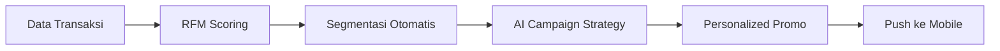

# SULTAN - Bank Sumut Gen-Z CRM Ecosystem

**Sistem Uang & Layanan Tabungan Andalan**


## 📌 Overview

Proyek ini adalah simulasi ekosistem **Hybrid CRM** yang dirancang khusus untuk **Bank Sumut**. Menggabungkan mobile banking gamified dengan CRM analytics untuk menjangkau nasabah Generasi Z.

### 🎯 Tiga Sistem Terintegrasi

| View | Target User | Fungsi |
|------|-------------|--------|
| 📱 **Mobile App** | Nasabah | Gamified banking, Dompet Impian |
| 💼 **Admin Dashboard** | Staff Bank | CRM analytics, kampanye |
| 📋 **RM Mobile** | Relationship Manager | Pipeline nasabah |

---

## ✨ Fitur Utama

### 📱 Mobile Banking
- **Glassmorphism UI** dengan brand color Sumut
- **Quick Actions**: Transfer, Top Up, Bills, QRIS
- **Dompet Impian**: Goal-based savings dengan kategori & deadline
- **Gamifikasi**: XP, Level, Badges, Daily Login
- **Personalized Promos** dari CRM

### 💼 Admin CRM
- **RFM Segmentation**: Champions, Loyal, Potential, At Risk, Hibernating
- **Customer 360 View**: Profil lengkap + AI Suggestion
- **Campaign Studio**: Builder kampanye berbasis segmen
- **Blast Promo** dengan Consent Guard
- **Column Customization** (saved to localStorage)
- **Tooltips** informatif di setiap widget

### 🔐 Security Features
- **RBAC**: Admin, RM, CS, Marketing, Viewer
- **MFA Simulation**: OTP untuk role Admin
- **Marketing Consent**: Opt-in/out, quiet hours, channel prefs

---

## 🛠️ Tech Stack

| Layer | Technology |
|-------|------------|
| Framework | React 18 + TypeScript |
| Styling | Tailwind CSS |
| Charts | Recharts |
| Icons | Lucide React |
| Build | Vite |
| AI | Google Gemini SDK |

---

## 🚀 Quick Start

```bash
# Install dependencies
npm install

# Run development server
npm run dev

# Open browser
http://localhost:5173
```

---

## 📁 Struktur Proyek

```
├── App.tsx                    # Main app + RBAC
├── constants.ts               # Mock data
├── types.ts                   # TypeScript types
├── components/
│   ├── mobile/
│   │   └── MobileApp.tsx      # Gamified mobile UI
│   └── admin/
│       ├── AdminDashboard.tsx # CRM dashboard
│       ├── Customer360View.tsx
│       ├── PipelineKanban.tsx
│       └── DemoSandbox.tsx
├── contexts/
│   └── DemoContext.tsx        # Shared state
└── services/
    └── geminiService.ts       # AI integration
```

---

## 📊 RFM Segmentation

| Segment | Strategi |
|---------|----------|
| **Champions** | Loyalty rewards, VIP treatment |
| **Loyal** | Cross-sell, upsell |
| **Potential** | Nurture, engagement |
| **At Risk** | Winback campaign |
| **Hibernating** | Reactivation |

---

## 👥 Demo Users

| Nama | Segment | Usia | Pekerjaan |
|------|---------|------|-----------|
| Budi Tarigan | Potential | 22 | Mahasiswa |
| Rahmat Hidayat | Champions | 42 | Pengusaha |
| Nina Kartika | Loyal | 29 | Karyawan Swasta |
| Dedi Prasetyo | At Risk | 51 | Wiraswasta |

---

## 🧠 CRM Logic Flow



---

## 📌 Feature Highlights (Latest)

- ✅ RBAC & MFA Simulation
- ✅ Marketing Consent Management
- ✅ Blast Promo Consent Guard
- ✅ Column Customization
- ✅ Dompet Impian: Celebration 100%, Deadline, AI Suggestion
- ✅ Widget Tooltips
- ✅ Realistic demo data

---

## 📅 Next Steps

- [ ] Backend API integration
- [ ] OJK-compliant ticketing SLA
- [ ] Audit log implementation
- [ ] KYC data quality rules
- [ ] AML/Fraud monitoring

---

**Dibuat untuk keperluan Laporan Inovasi Digital Bank Pembangunan Daerah Sumatera Utara.**
